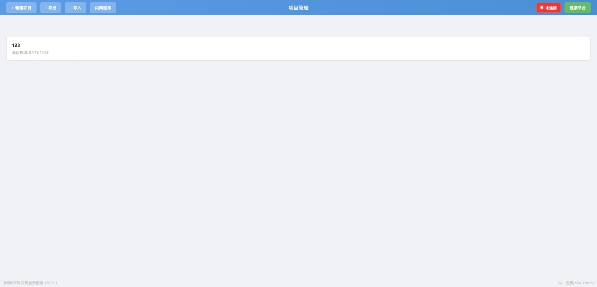
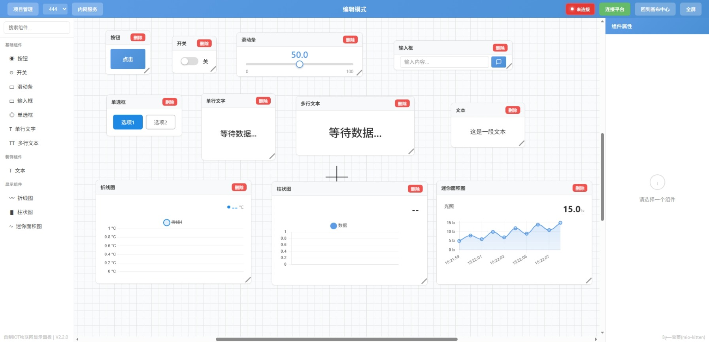
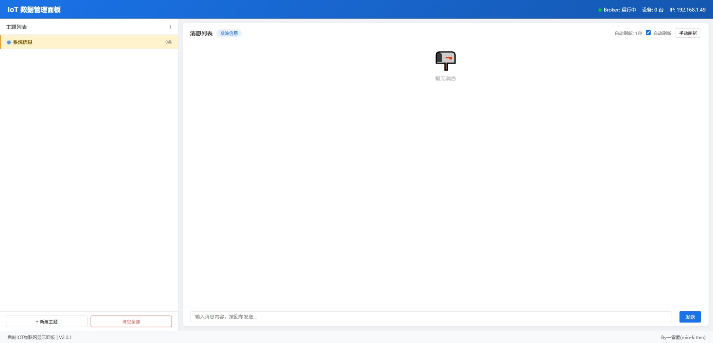

<div align="center">

# ZzIOT 
### > 一个物联网数据可视化面板 + 本地内网创建服务(包括无网) 的集合工具体 <
---
[](https://github.com/mio-kitten/zziot)
[](https://github.com/mio-kitten/zziot)
[](https://vuejs.org/)
[](https://www.electronjs.org/)
[](https://www.typescriptlang.org/)

</div>

---

## 🎯说明

| 项目 | 详情 |
| --- | --- |
| **所用技术栈** | Vue 3、Electron 28+、TypeScript、Chart.js、MQTT.js、Vite |
| **已支持的平台** | Windows 10 及以上X64 |
| **组件数量** | 11 个 |
| **状态** | 开发中 |
|**版本** | V2.3.26.819 | 

---

``V1.0.0作为自由开发版本没有署名，提供了基础架构但仍有BUG，之后的版本会有署名但如果需修改引用请说明本原作者``

---

## 🪁项目简介

- 本项目是一个基于 Vue 3 + Electron 开发的物联网数据可视化工具集合，用于显示和分析物联网设备的数据与搭建内网服务，对于物联网比赛的相关要求基本符合且能创建本地内网以供使用；本项目特大部分的代码来自于AI模型，可视化面板的各个功能来自mind+，模型都经过了训练，可以说是一个AI作品，但是我有在对项目进行优化，确保使用的体验，谢谢大家的理解

-----------------

## ✨项目优点：
- ``运行：项目完全由本地化运行，数据存储于本地，且数据读取快，省去了长加载时间``
- ``组件：多行文本、折线图，可供多主题画图显示，同样有与mind+相同的单主题数据并和画图，也有可以读取多主题画图的功能,更有利于UDP多主板发送信息进行绘图或对比``
- ``页面：编辑模式与查看模式下拥有更大的画布，清晰的中心点显示，更有利于多组件的摆放``
- ``功能：提供了三种连接选择↓↓↓``
- ##### 本项目拥有巴法云MQTT、传统的SIoT V2本地化连接与本地化内网创建
- ###### 本地化内网创建，可用于替代SIoT只能通过已连接网络创建IP的限制，无论是否有网，都可以创建内网连接（有网卡的电脑设备），并且我们还有一个与SIoT同样的数据查看网页，而且实时连接显示型比SIoT更好！
- ``存储：本项目提供了在编辑模式和查看模式（全屏）下的快捷切换不同项目的功能，并且每个项目的连接配置均会有保存，能实现切换项目自动连接之前已配置好了的平台（内网/SIoT 或 巴法云MQTT）``
#### 总结：这是一个船新的本地化面板，能有效满足物联网比赛中相关的网络需求，还能保持在现场比赛中更稳定的内网数据传输，不会频繁掉线！

> 这里指mind+版本为V1.8.1；之后的V2等版本是否会有本项目所优化的功能暂不考究<del>（毕竟V2的可视化面板目前也没有让用）</del>

### 🎈项目管理界面



---

## ❗注意事项

作为仿制作品，使用时请注意以下几点：

**1.** _请注意仔细阅读文件里的 **使用说明** 和程序运行时 **网页端和命令窗口的注释提示** ！_

**2.** 运行方式：
   - 直接下载本项目所有文件并放在任意文件夹
   - 点击 `检查安装依赖.bat`，程序会自动检查本机使用架构并调用文件夹中对应的 Node.js 安装包进行安装，然后检查是否安装vue等相关依赖并安装
   - 如果安装失败，按照本机系统的架构选择运行 `node-v24.18.0-x64.msi` 或 `node-v24.18.0-arm64.msi` 安装包或检查网络连接
   - 安装完成后，不要再点击"检查安装依赖"，根据需求运行`启动可视化面板.bat`或`启动内网服务.bat`即可

**3.** 环境要求：
   - 本项目基于 Vue 与 Node.js 开发，需要浏览器支持
   - 因为 Node.js v24 安装需要 Windows 10 或更高版本且无 X86 版本的安装包（32位），本项目理应只支持 Windows 10 及以上 X64 版本

**4.** 组件支持：能力有限，目前仅实现了 11 个组件：
   - BarChartWidget（柱状图）
   - ButtonWidget（按钮）
   - DecorativeTextWidget（文本）
   - InputWidget（输入框）
   - LineChartWidget（折线图）
   - MiniAreaWidget（迷你面积图）
   - RadioWidget（单选框）
   - SliderWidget（滑动条）
   - SwitchWidget（开关）
   - TextWidget（单行文字）
   - TextareaWidget（多行文本）

### 🎈编辑界面



### 🎈数据管理界面




---

## 🎫开发命令

```bash
# 安装依赖
npm install

# 开发模式
npm run dev

# 构建生产版本
npm run build

# 启动 Electron
npm run electron:start

# 打包 Electron 应用
npm run electron:build
```

---

# 😍下载方式：GitHub Releases 中下载 压缩包 (永远保持最新)

#### 或

### 用123云盘下载（V2.3.26.819）：

[网盘链接（rar包体59.56 MB）](https://1842972489.share.123pan.cn/123pan/SJqUTd-Do6l3)
> 提取码：NOTH

    版本号详解，例：V2.3.26.819
                    ———— ——————
               小的版本号 日期：2026年8月19日
---

## 使用限制

* 本项目完全免费，且开源发布于 GitHub 面向全世界人用作对技术的学习交流。本项目不对项目内的技术可能存在违反当地法律法规的行为作保证。

* 禁止在违反当地法律法规的情况下使用本项目。对于使用者在明知或不知当地法律法规不允许的情况下使用本项目所造成的任何违法违规行为由使用者承担，本项目不承担由此造成的任何直接、间接、特殊、偶然或结果性责任。

---

## 非商业性质

* 本项目仅用于对技术可行性的探索及研究，不接受任何商业（包括但不限于广告等）合作及捐赠。

---

## 接受协议

* 若你使用了本项目，即代表你接受本协议。

---

## 许可证

MIT License
